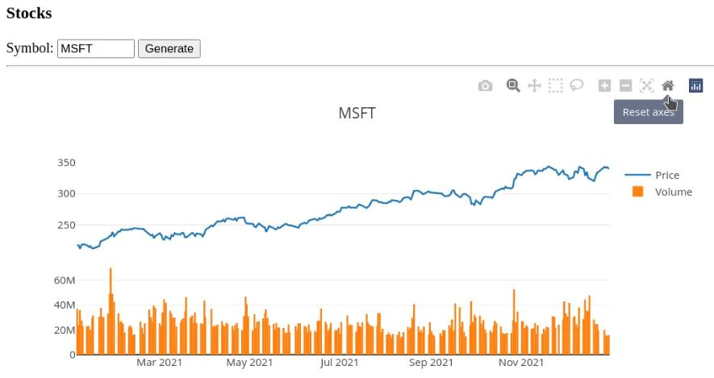

# Plotting Stock Information - Visualization in Go

+++
title = "Plotting Stock Information - Visualization in Go"
date = "FIXME"
tags = ["golang"]
categories = [ "golang" ]
url = "FIXME"
author = "mikit"
+++

You'd like to visualize some stock data. Looking at the Go ecosystem, you see very little in charting, [gonum](https://github.com/gonum/plot) has some plotting capabilities, but it generates static charts. It's 2022 and you'd like interactive features such as zooming, panning and more. Looking at the HTML landscape, you see many more options and decide to take this path. After a short survey, you decide to use [plotly](https://plotly.com/javascript/).

To get stock information, you'll use [Yahoo! finance](https://plotly.com/javascript/) that lets you download CSV with historical information.


**Listing 1: Example CSV**

```
Date,Open,High,Low,Close,Adj Close,Volume
2021-01-04,222.529999,223.000000,214.809998,217.690002,215.880432,37130100
2021-01-05,217.259995,218.520004,215.699997,217.899994,216.088669,23823000
2021-01-06,212.169998,216.490005,211.940002,212.250000,210.485641,35930700
2021-01-07,214.039993,219.339996,213.710007,218.289993,216.475418,27694500
2021-01-08,218.679993,220.580002,217.029999,219.619995,217.794388,22956200
2021-01-11,218.470001,218.910004,216.729996,217.490005,215.682083,23031300
```

Listing one shows an example CSV download from Yahoo! finance. You're going to use only the `Date`, `Close` and `Volume` columns.


Let's start! First we'll parse the data

**Listing 2: Parsing Time**

```
37 // unmarshalTime unmarshal data in CSV to time
38 func unmarshalTime(data []byte, t *time.Time) error {
39     var err error
40     *t, err = time.Parse("2006-01-02", string(data))
41     return err
42 }
```

Listing 2 shows parsing of time. In CSV everything is text, and we need to help `csvutil` to know how to parse time. On line 40 we use `time.Parse` to parse time from a string in the format `2021-01-11`.

**Listing 3: Date Types**

```
23 // Row in CSV
24 type Row struct {
25     Date   time.Time
26     Close  float64
27     Volume int
28 }
29 
30 // Table of data
31 type Table struct {
32     Date   []time.Time
33     Price  []float64
34     Volume []int
35 }
```

Listing 3 shows the data types used in parsing. On line 24 we define `Row` which corresponds to a row in the CSV, we define only 3 fields for the columns we're interested in. `Close` is used to represent the stock price in that day. On line 31 we define the output type - `Table`. We have three columns of data: `Data`, `Price` (from the `Close` column in the CSV) and `Volume`.

**Listing 4: Parsing Data**

```
44 // parseData parses data from r and returns a table with columns filled
45 func parseData(r io.Reader) (Table, error) {
46     dec, err := csvutil.NewDecoder(csv.NewReader(r))
47     if err != nil {
48         return Table{}, err
49     }
50     dec.Register(unmarshalTime)
51 
52     var table Table
53     for {
54         var row Row
55         err := dec.Decode(&row)
56 
57         if err == io.EOF {
58             break
59         }
60 
61         if err != nil {
62             return Table{}, err
63         }
64 
65         table.Date = append(table.Date, row.Date)
66         table.Price = append(table.Price, row.Close)
67         table.Volume = append(table.Volume, row.Volume)
68     }
69 
70     return table, nil
71 }
```

Listing 4 shows how to parse the data. On line 46 we create a new `csvutil.Decoder` and on line 50 we register `unmarshal` to handle `time.Time` fields. On line 52 we define the output value `table`. On line 53 we start iterating over the input, on line 54 we define `row` and on line 55 we decode the current line in the CSV into it. On line 57 we check for the end of input and on line 61 we check for other errors. On lines 65-67 we append the values from the current row to the respective columns. Finally on line 70 we return the parsed input.

_Note: To test this code, I've downloaded a CSV file one and used `parseData` on the opened file. This make the development cycle faster and also reduces the chances you'll be banned from hitting the API too frequently._

Once we have parsed the data, we can get it from Yahoo! finance.

**Listing 5: Building the URL**

```
73 // buildURL builds URL for downloading CSV from Yahoo! finance
74 func buildURL(symbol string, start, end time.Time) string {
75     u := fmt.Sprintf("https://query1.finance.yahoo.com/v7/finance/download/%s", url.PathEscape(symbol))
76     v := url.Values{
77         "period1":  {fmt.Sprintf("%d", start.Unix())},
78         "period2":  {fmt.Sprintf("%d", end.Unix())},
79         "interval": {"1d"},
80         "events":   {"history"},
81     }
82 
83     return fmt.Sprintf("%s?%s", u, v.Encode())
84 }
```

Listing 5 shows how to build the URL to fetch the CSV. The final URL looks like:

```
https://query1.finance.yahoo.com/v7/finance/download/MSFT?period1=1609286400&period2=1640822400&interval=1d&events=history
```
On line 75 we use `fmt.Sprintf` and `url.PathEscape` to create the first part of the URL (up to `?`). On lines 76 to 80 we create the query part of the URL using a `url.Values`. Finally on line 83 we return the full URL. 

**Listing 6: Getting the Data**

```
86 // stockData returns stock data from Yahoo! finance
87 func stockData(symbol string, start, end time.Time) (Table, error) {
88     u := buildURL(symbol, start, end)
89     resp, err := http.Get(u)
90     if err != nil {
91         return Table{}, err
92     }
93     if resp.StatusCode != http.StatusOK {
94         return Table{}, fmt.Errorf("%s", resp.Status)
95     }
96     defer resp.Body.Close()
97 
98     return parseData(resp.Body)
99 }
```

Listing 6 shows how we get the data. On line 88 we build the URL and on line 89 we make an HTTP `GET` request. On lines 90 and 93 we check for errors and finally on line 98 we return the result of `parseData` on the response body.

Now that we get and parse our data, we can build our web server.

**Listing 7: index.html**

```
01 <!DOCTYPE html>
02 <html>
03     <head>
04         <title>Stocks</title>
05         <script src="/plotly-2.8.3.min.js"></script>
06         <script src="/chart.js"></script>
07         <style>
08                 #symbol {
09                     width: 6em;
10                 }
11                 #chart {
12                     width: 800px;
13                     height: 400px;
14                 }
15         </style>
16     </head>
17     <body>
18         <h3>Stocks</h3>
19         Symbol: <input id="symbol"> <button id="generate">Generate</button>
20         <hr />
21         <div id="chart"></div>
22     </body>
23 </html>
```

Listing 7 shows the `index.html`. On line 05 we load the plotly JavaScript library and  on line 06 we load our JavaScript code. On line 19 we define the input control for the symbol (stock) an on line 21 we have the `div` that plotly will draw the chart on.

**Listing 8: chart.js**

```
01 async function updateChart() {
02     let symbol = document.getElementById('symbol').value;
03     let resp = await fetch('/data?symbol=' + symbol);
04     let reply = await resp.json(); 
05     Plotly.newPlot('chart', reply.data, reply.layout);
06 }
07 
08 document.addEventListener('DOMContentLoaded', function () {
09     document.getElementById('generate').onclick = updateChart;
10 });
```

Listing 9 shows the JavaScript code. On line 01 we define a function to update the chart. On line 02 we get the symbol name from the HTML input. On line 03 we call our server to get the data and on line 04 we parse the JSON. Finally on line 05 we use plotly to generate a new chart.

On lines 08-10 we hook the "Generate" button click to call `updateChart`.

**Listing 10: Data Handler**

```
101 // dataHandler returns JSON data for symbol
102 func dataHandler(w http.ResponseWriter, r *http.Request) {
103     symbol := r.URL.Query().Get("symbol")
104     if symbol == "" {
105         http.Error(w, "empty symbol", http.StatusBadRequest)
106         return
107     }
108     log.Printf("data: %q", symbol)
109     start := time.Date(2021, time.January, 1, 0, 0, 0, 0, time.UTC)
110     end := time.Date(2021, time.December, 31, 0, 0, 0, 0, time.UTC)
111     table, err := stockData(symbol, start, end)
112     if err != nil {
113         log.Printf("get %q: %s", symbol, err)
114         http.Error(w, "can't fetch data", http.StatusInternalServerError)
115         return
116     }
117 
118     if err := tableJSON(symbol, table, w); err != nil {
119         log.Printf("table: %s", err)
120     }
121 }
```

Listing 10 shows the data handler. On line 103 we extract the symbol from the HTTP `symbol` parameter. On line 111 we call `stockData` to get the stock data and finally on line 118 we convert the `Table` output to JSON.

**Listing 11: Table as JSON**

```
123 // tableJSON writes table data as JSON into w
124 func tableJSON(symbol string, table Table, w io.Writer) error {
125     var reply struct {
126         Data [2]struct {
127             X     interface{} `json:"x"`
128             Y     interface{} `json:"y"`
129             YAxis string      `json:"yaxis,omitempty"`
130             Name  string      `json:"name"`
131             Type  string      `json:"type"`
132         } `json:"data"`
133         Layout struct {
134             Title string `json:"title"`
135             Grid  struct {
136                 Rows    int `json:"rows"`
137                 Columns int `json:"columns"`
138             } `json:"grid"`
139         } `json:"layout"`
140     }
141 
142     reply.Layout.Title = symbol
143     reply.Layout.Grid.Rows = 2
144     reply.Layout.Grid.Columns = 1
145     reply.Data[0].X = table.Date
146     reply.Data[0].Y = table.Price
147     reply.Data[0].Name = "Price"
148     reply.Data[0].Type = "scatter"
149     reply.Data[1].X = table.Date
150     reply.Data[1].Y = table.Volume
151     reply.Data[1].Name = "Volume"
152     reply.Data[1].Type = "bar"
153     reply.Data[1].YAxis = "y2"
154 
155     return json.NewEncoder(w).Encode(reply)
156 }
```

Listing 11 shows how we convert a `Table` to JSON used by our JavaScript code. On lines 125-139 we define an anonymous struct that will be marshalled to JSON. On lines 142 to 153 we fill this struct, telling plotly how we want the data to be displayed. Line 145 and 146 fill the `x` and `y` for the price, line 147 sets the title and on line 148 we specify we want a scatter (line) chart. On line 149 and 150 we set the `x` and `y` for the volume. On line 151 we wet the title and on line 152 we specify we want a bar chart. On line 153 we tell poltly we want a separate y axis for the volume. Finally on line 155 we use a `json.ENcoder` to encode this struct.

**Listing 12: Embedding Files**

```
18 var (
19     //go:embed chart.js index.html plotly-2.8.3.min.js
20     staticFS embed.FS
21 )
```

Listing 12 shows how we embed the non-Go files in our server using the `embed` package. On line 19 we use a `go:embed` directive to embed several files and on line 20 we define `staticFS` that implements `fs.FS` interface.

**Listing 13: Running The Server**

```
158 func main() {
159     http.Handle("/", http.FileServer(http.FS(staticFS)))
160     http.HandleFunc("/data", dataHandler)
161 
162     if err := http.ListenAndServe(":8080", nil); err != nil {
163         log.Fatal(err)
164     }
165 }
```

Listing 13 shows the `main` function. On line 159 we use an `http.FileServer` to server the embedded files and on line 160 we route `/data` to the `dataHandler`. Finally on line 162 we run the server on port 8080.

The final result look like the below image:




## Conclusion

With about 170 lines of code we manage to create an interactive application that displays stock information. `plotly` is a very mature library with a lot of features [the documentation](https://plotly.com/javascript/) is great. I usually start with a chart that looks similar to what I want to display and adjust to my needs.

If your code is in a database, you might need [zero code](https://github.com/kelseyhightower/nocode) to display it. Products such as [grafana](https://grafana.com/), [Google Data Studio](https://datastudio.google.com) and others allow you to create cool dashboards with very little effort.

What cool visualizations did you create with Go? [Let me know](mailto:miki@353solutions.com)

